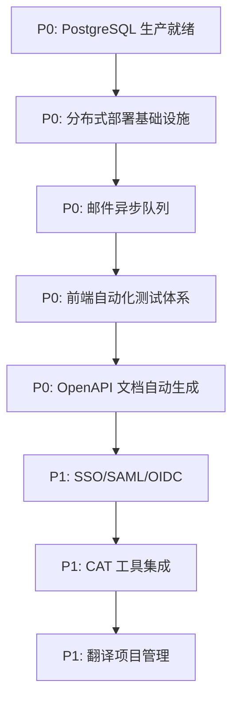

# 能言 SaaS 系统优化方案

> 版本：v1.0  
> 生成时间：2026-08-30  
> 评审范围：全仓代码（backend-go、frontend-react、extension、deploy、sdk）+ 运行时配置 + 部署脚本 + 历史整改方案  
> 评审方式：端到端全量阅读、像素级场景全分支跟踪  
> 依据文档：`ARCHITECTURE_REVIEW_REPORT.md`、`MODULE_GAP_ANALYSIS.md`、`PRIORITY_IMPLEMENTATION_PLAN.md`、`TECH_DEBT_REFACTOR_ROADMAP.md`、`GREPPABLE_TECH_DEBT_CHECKLIST.md`

---

## 〇、修订与落地决策（2026-08-30，执行前必读）

> 本节为对 v1.0 的**纠偏与落地口径**，优先级高于下文 §3/§4 的原表。原表保留作为能力清单参考，但各项"状态/工时"以本节为准。

### 0.1 结论摘要

- 文档**方向成立**：业务确认未来会规模化增长，提前解除 SQLite 单写者天花板、补齐异步/可观测能力是正确投资。
- 但文档**多处将"已实现"误判为"待从零开发"**，导致 P0 工时与优先级失真。经全仓代码核对，以下能力**代码层面已完成**，缺口仅在"部署切换/接入"：

| 文档列为 P0 待办 | 代码实际状态 | 位置 |
|---|---|---|
| P0-3 SQLite→PostgreSQL 迁移（4 人周） | 双方言层**已实现**：DSN 切换、`?`→`$n` 占位符改写、DDL 翻译、迁移脚本、pg_dump 备份、PG 集成测试齐备 | `internal/db/db.go`、`rewrite.go`、`query.go`、`migrate.go`、`backup.go`、`db_pg_integration_test.go` |
| P0-2 向量检索外置 pgvector（4 人周） | **双写已实现**：PG+pgvector 优先检索、缺失自动回退 npz；`EnablePgvector` 连接时自动 `CREATE EXTENSION vector` | `internal/kb/db.go:989 UpsertEmbedding`、`:1005 VectorSearch`、`engine.go:1755 RebuildKBIndex`、`db.go:98` |
| P0-4 邮件异步队列 | 队列接缝**已实现**：jobs 表 + 租约超时回收 + 重试 + 死信，仅需接入邮件任务类型 | `internal/queue/queue.go`、`service/ticket.go:92 workerLoop` |

### 0.2 落地口径（做 / 不做）

**做（激活既有能力 + 补齐真实缺口）**：

- **A. PostgreSQL 真正用起来**：补 PG 驱动 blank-import、`DB_DRIVER=postgres`+`DB_DSN` 部署切换、写一次性 SQLite→PG 数据迁移工具、切流后跑 `RebuildKBIndex` 回填 pgvector。**用托管 RDS PG（自带 HA/备份/故障转移），不自建 Patroni/etcd。**
- **B. 邮件异步**：复用 `internal/queue` 把 `mail.Sender.Send` 改为入队 + worker 发送 + 重试/死信。**不引入 Redis Streams/Outbox/Sidecar。**
- **C. 统一错误码 + 结构化日志**：新增 `internal/errors` 枚举 + `log/slog` 结构化日志 + `X-Trace-ID` 中间件；先覆盖关键路径（auth/billing/translate/openapi），渐进迁移。**不引 Zap 等新增重依赖（slog 为 stdlib）。**
- **D. 对照编辑器（新 feature，文本+文件）**：新增 `translation_edits` 表 + `GET/POST /api/tickets/:id/segments` + 前端双栏编辑器（源文只读/译文可编辑 + 术语高亮 + 逐段通过/驳回批注）。文件工单 MVP 先支持 xlsx/csv/对照表产物，docx/pdf 段落提取为二期。

**不做（当前过度设计，待真实触发条件出现再启动）**：

- Redis Cluster / etcd / gRPC Sidecar / K8s 微服务拆分 / 多区域：单机 1G 时代与初期规模化阶段不需要；先把"模块化单体"以多个无状态副本 + Caddy/LB 跑起来即可。
- SSO/SAML/SCIM/白标/CAT 插件/混沌工程/SDK 自动发布流水线：等具体企业客户或规模化运维诉求出现再做。

### 0.3 P0/P1 状态修订

| 原编号 | 修订后状态 | 说明 |
|---|---|---|
| P0-2 pgvector | ✅ 已实现，待部署激活 | 见 0.1 |
| P0-3 PG 迁移 | 🟡 脚手架已实现，待"部署切换 + 数据迁移工具" | 见工作流 A |
| P0-4 邮件异步 | ✅ 已落地（复用 jobs 表队列 + 死信，关键路径已接入） | 见工作流 B |
| P0-5 前端测试 | ⚪ 维持原判断，按容量渐进 | Vitest/Playwright 脚手架 |
| P0-1 对照编辑器 | 🆕 改为新 feature（文本+文件） | 见工作流 D |
| P1-R1/R2 错误码/日志 | ✅ 已建立框架（internal/errors 枚举 + slog 结构化日志 + X-Trace-ID 中间件），关键路径 auth 已迁移 | 见工作流 C |
| 其余 P1（SSO/白标/CAT…） | ⏸ 暂缓 | 见 0.2"不做" |

### 0.5 落地状态（2026-08-30，commit 76f4410 已 push origin/main）
- A：PG 连接池配置 env（`DB_MAX_OPEN_CONNS`/`DB_MAX_IDLE_CONNS`/`DB_CONN_MAX_LIFETIME_MIN`）接入 `config.go` 并透传 `db.Open`；PG 驱动此前已在 `main.go` blank-import。A2 一次性迁移工具 `cmd/migrate-sqlite-to-pg/main.go` 已就绪（仅待真实 PG 环境实跑）。
- B：邮件改走 `internal/queue` 异步（`ticket.go` 的 `processMailJob` + `mail_tpl.go` 入队），SMTP 抖动由队列重试/死信吸收。
- C：统一错误码 `internal/errors`（保留 `success:false` 兼容旧前端）+ `slog` JSON 结构化日志（`observability/log.go`）+ `accesslog.go` 最外层 `X-Trace-ID` 中间件；`auth.go` 关键分支已迁移。
- D：对照编辑器已落地（见 PROGRESS.md 〇-H）。**选用 slog 而非 Zap**：slog 为 Go 标准库，零新增重依赖，符合 0.1"不引 Zap"的纠偏。

### 0.4 执行顺序

1. **A（PG 切换）** 在维护窗口做，先演练数据迁移与回滚；
2. **B、C** 可并行开发（低风险、向后兼容）；
3. **D** 独立 feature 分支，前端+后端联调。

---

## 一、优化总览

### 1.1 现状评估

**系统定位**：这是一个「功能极其完备、工程质量极高、商业化闭环已跑通」的单机版 AI 翻译协作 SaaS 系统。在翻译引擎、知识库隔离、计费精度、文件管线、多租户权限、部署加固等核心链路上已将「坑」踩完并填平。

**核心能力已完备**：
- ✅ 翻译引擎：四段匹配（精确/CJK/模糊/语义）+ 熔断降级 + 并发限流 + 实时计费 + 硬闸重试 + 漏翻可见性
- ✅ 知识库：五档可见范围（部门 > 跨部门 > 企业 > 行业 > 文化）+ 组织继承链 + pgvector/npz 双后端
- ✅ 计费体系：双桶台账（发放 + 永久）+ 实时计量批量落库 + 每日配额/QPS/并发 + 发票/商业包/邀请裂变
- ✅ 文件翻译：PDF 两阶段（docx 中转）+ PPTX/XLSX 原格式回写 + 字幕/MD/JSON/YAML 对照表 + 硬闸补漏
- ✅ 多租户：JWT 租户上下文 + 组织树 + 部门预算墙 + API Key 归属绑定 + 跨租户越权全链路防御
- ✅ 异步任务：Direct queue（jobs 表 + 租约超时回收 + 重试 + 死信）+ 启动断点续跑 + 卡死巡检
- ✅ 安全加固：systemd 沙箱 + 密钥 EnvironmentFile(0600) + CORS deny-by-default + API Key AES-GCM 加密 + 支付真实验签

**架构天花板**：
- ⚠️ SQLite 单写者（硬上限 ~100-200 QPS）
- ⚠️ 进程内缓存/队列/向量索引（无统一框架、无分布式）
- ⚠️ Python 子进程强耦合（pdf2docx/LibreOffice）
- ⚠️ 前端状态分散（useChat/useAuth/useBranding 多 Context）
- ⚠️ 可观测性仅有 /metrics（无分布式追踪、无 SLO/SLI）
- ⚠️ OpenAPI 文档手写维护（无 Spec 自动生成）

### 1.2 优化目标

| 维度 | 当前状态 | 优化目标 | 衡量指标 |
|------|----------|----------|----------|
| **可用性** | 单机无 HA | 多机高可用、故障自动转移 | RTO <30s、RPO <1h |
| **性能** | SQLite ~200 QPS | 10k+ QPS、百万级 KB | P99 <100ms |
| **扩展性** | 单进程 | 微服务化、独立扩缩容 | 30 分钟新增节点 |
| **工程质量** | 零前端测试、手写 OpenAPI | 自动化测试体系、Spec 驱动 | 测试覆盖率 >80% |
| **可观测性** | /metrics | 全链路追踪 + SLO + 告警 | 故障定位 <10min |
| **企业级** | 基础多租户 | SSO/RBAC/白标/插件生态 | 企业客户 100+ |

### 1.3 优化原则

| 原则 | 说明 | 执行方式 |
|------|------|----------|
| **主干始终可发布** | 任何优化不阻塞业务迭代 | Feature Flag 守护、分支寿命 <3 天、小步提交 |
| **数据不重写** | 存量数据迁移而非重建 | 双写验证 → 读切换 → 停写旧表 → 归档 |
| **接口先行** | 定义契约再实现 | Protobuf/gRPC 定义 → Mock Server → Consumer 先接入 |
| **可观测优先** | 优化前先有基线指标 | 每个组件必须有：RED 指标、日志结构化、TraceID 透传 |
| **回滚预案** | 每次优化必须有回滚脚本 | 数据库迁移可逆、配置可热回滚、蓝绿部署就绪 |
| **存算分离** | 消除单点写瓶颈 | PostgreSQL + Redis + 对象存储 |
| **组件服务化** | 消除进程内耦合 | LLM Gateway / Vector Search / File Converter / Task Executor Sidecar 化 |

---

## 二、优化架构蓝图

### 2.1 目标架构（Phase 1：存算分离）

```
┌─────────────────────────────────────────────────────────────────────────────┐
│                           目标架构（Phase 1）                                  │
├─────────────────────────────────────────────────────────────────────────────┤
│                                                                             │
│  ┌──────────────────────────────────────────────────────────────────────┐   │
│  │  Go API Gateway（Stateless，可水平扩缩）                                 │   │
│  │  ├── /api/*             → 业务逻辑（保留单体，但无状态）                  │   │
│  │  ├── /openapi/*       → 同业务逻辑                                     │   │
│  │  ├── /metrics         → Prometheus 指标                               │   │
│  │  └── /health          → 健康检查                                       │   │
│  └──────────────────────────┬───────────────────────────────────────────┘   │
│                              │ gRPC/HTTP                                   │
│  ┌──────────────────────────┼───────────────────────────────────────────┐   │
│  │                     Sidecar Services (gRPC)                             │   │
│  │  ┌──────────────┐ ┌──────────────┐ ┌──────────────┐ ┌────────────┐ │   │
│  │  │ LLM Gateway  │ │ Vector Search│ │ File Conv.   │ │ Task Exec. │ │   │
│  │  │ ModelRoutes  │ │ pgvector     │ │ LibreOffice  │ │ Streams    │ │   │
│  │  │ 熔断/成本    │ │ 增量索引     │ │ OCR 可选     │ │ 断点续跑   │ │   │
│  │  │ 竞速路由     │ │ 混合检索     │ │ 容器化       │ │ 幂等消费   │ │   │
│  │  └──────────────┘ └──────────────┘ └──────────────┘ └────────────┘ │   │
│  └──────────────────────────┬───────────────────────────────────────────┘   │
│                              │                                             │
│  ┌──────────────────────────┼───────────────────────────────────────────┐   │
│  │                     数据层                                              │   │
│  │  ┌──────────────┐ ┌──────────────┐ ┌──────────────┐ ┌────────────┐ │   │
│  │  │ PostgreSQL   │ │ Redis        │ │ 对象存储     │ │ etcd       │ │   │
│  │  │ 主库 + 逻辑复制│ │ Cluster      │ │ (OSS/S3)    │ │ Config     │ │   │
│  │  │ pgvector     │ │ ├─ L2 缓存   │ │ 产物/备份    │ │ Service    │ │   │
│  │  │ ├─ 业务表    │ │ ├─ Streams   │ │              │ │ ├─ 统一配置 │ │   │
│  │  │ ├─ 审计日志  │ │ ├─ 分布式锁  │ │              │ │ └─ Schema   │ │   │
│  │  │ └─ 向量表    │ │ └─ 延迟队列  │ │              │ │             │ │   │
│  │  └──────────────┘ └──────────────┘ └──────────────┘ └────────────┘ │   │
│  └──────────────────────────────────────────────────────────────────────┘   │
│                                                                             │
│  ┌──────────────────────────────────────────────────────────────────────┐   │
│  │  运维层                                                                 │   │
│  │  ├── Grafana + Loki + Tempo（可观测性三剑客）                           │   │
│  │  ├── Prometheus + AlertManager（指标 + 告警）                         │   │
│  │  ├── Pact + Testcontainers + Playwright（测试金字塔）                 │   │
│  │  └── Kong/Traefik（API 网关 + 限流）                                  │   │
│  └──────────────────────────────────────────────────────────────────────┘   │
└─────────────────────────────────────────────────────────────────────────────┘
```

### 2.2 当前架构 → 目标架构演进路径

```
当前 (单体 SQLite)
    │
    ├── Phase 1: 存算分离、组件服务化（6-8 周）
    │     ├── SQLite → PostgreSQL（含 pgvector）
    │     ├── 进程内缓存 → Redis Cluster L2
    │     ├── Direct queue → Redis Streams L2
    │     ├── Python 子进程 → File Converter gRPC 服务
    │     ├── LLM ModelRoutes → LLM Gateway gRPC 服务
    │     ├── system_config → etcd Config Service
    │     └── 单进程 → K8s 部署 + HPA
    │
    ├── Phase 2: 规范化工程化、可观测性（4-6 周）
    │     ├── 统一错误码体系
    │     ├── slog（stdlib）结构化日志 + TraceID 透传
    │     ├── 分布式追踪（Tempo/Jaeger）
    │     ├── SLO/SLI 定义 + Burn Rate 告警
    │     ├── Contract Testing（Pact）
    │     ├── Integration Testing（Testcontainers）
    │     ├── E2E Testing（Playwright）
    │     ├── OpenAPI Spec 自动生成（oapi-codegen）
    │     ├── 多语言 SDK 自动发布流水线
    │     ├── 国际化工程化（Lingui）
    │     └── 前端状态统一（Zustand）
    │
    └── Phase 3: 企业级特性、生态扩展、智能化（持续演进）
          ├── SSO/SAML/OIDC 企业身份联合
          ├── SCIM 2.0 组织同步
          ├── 细粒度 RBAC（资源级/字段级）
          ├── 白标部署（自定义域名 + CNAME）
          ├── CAT 工具集成（Trados/memoQ/XLiff）
          ├── 翻译项目管理（甘特图/资源分配/预算）
          ├── 术语协作编辑/审批流
          ├── 插件生态商店化
          ├── AI 翻译记忆/术语自动抽取
          └── 智能化运维（容量规划/自动扩缩容/混沌工程）
```

---

## 三、优化详细方案

### 3.1 数据库优化：SQLite → PostgreSQL

#### 3.1.1 问题诊断

| 问题 | 严重度 | 根因 | 影响 |
|------|--------|------|------|
| 单写者瓶颈 | P1 | `modernc.org/sqlite` + `_txlock=immediate` | 硬上限 ~200 QPS |
| 无 HA | P1 | 单文件数据库 | 进程/节点故障 = 服务不可用 |
| 无读写分离 | P2 | 所有请求读写同一实例 | 读密集场景拖累写性能 |
| 备份锁库 | P2 | WAL 备份需排他锁 | 备份期间写阻塞 |
| 向量检索内存全量 | P1 | NPZ 启动加载全量 | >50万条 OOM、重建耗时 |

#### 3.1.2 迁移方案

```
┌──────────────────────────────────────────────────────────────────────┐
│                     数据库迁移策略（Strangler Fig + 双写）              │
├──────────────────────────────────────────────────────────────────────┤
│                                                                     │
│  阶段 1：Schema 迁移                                                 │
│  ├── 使用 sqlc 生成 PG/SQLite 双 dialect                            │
│  ├── 逐表创建 PG 表结构 + 索引 + 约束                                 │
│  ├── 迁移脚本版本化（golang-migrate）                                │
│  └── 验收：`go generate` 通过、零手写 SQL 差异                      │
│                                                                     │
│  阶段 2：双写中间件                                                   │
│  ├── Store 接口双写 PG + SQLite                                     │
│  ├── 一致性校验 Job（定时对比两库）                                   │
│  ├── 事务保证：PG 成功才标记 SQLite 完成                              │
│  └── 验收：单表双写一致性 100%、延迟 <5ms                            │
│                                                                     │
│  阶段 3：读流量渐进切 PG                                             │
│  ├── Feature Flag 控制读端（0% → 10% → 50% → 100%）                │
│  ├── 监控：P99 延迟、错误率、双写不一致率                             │
│  ├── 回滚：一键切回 SQLite                                           │
│  └── 验收：P99 延迟 <50ms、零错误                                    │
│                                                                     │
│  阶段 4：写流量切 PG + pgvector                                      │
│  ├── 写流量全切 PostgreSQL                                           │
│  ├── pgvector 扩展建表 + 向量数据迁移                                │
│  ├── SQLite 降级为只读备份（30 天后归档）                              │
│  └── 验收：主从切换 <30s、备份不锁库                                  │
│                                                                     │
│  阶段 5：HA 部署                                                     │
│  ├── PostgreSQL 主从流复制                                           │
│  ├── Patroni / pgpool-II 自动故障转移                                │
│  ├── 定时备份 + 对象存储归档                                         │
│  └── 验收：杀主演练 3 次全通过                                       │
│                                                                     │
└──────────────────────────────────────────────────────────────────────┘
```

#### 3.1.3 pgvector 接入

| 子任务 | 交付物 | 验收标准 | 工时 |
|--------|--------|----------|------|
| pgvector 扩展安装 | PG 扩展 + 向量表 | 100万条建索引 <30min | 0.5 周 |
| 增量索引 gRPC | UpsertVector/DeleteVector/SearchVector | 单条写入 <10ms、增量不重建 | 1 周 |
| 混合检索 | 稀疏(BM25)+稠密混合、重排序、租户/包/语言过滤 | 召回率 ≥NPZ 版、P99 <100ms | 1.5 周 |
| Shadow 切流 | 新旧索引并行写、读端对比一致性、流量渐进 10%→100% | 一致性 100%、零回归 | 1 周 |

#### 3.1.4 关键代码改动点

```go
// 当前：SQLite Store 统一接口
// 优化：抽象 Store 接口，支持 PG/SQLite 双实现

// store.go - 定义 Store 接口
type Store interface {
    // 业务表操作（PG + SQLite 双实现）
    CreateTicket(ctx context.Context, t *Ticket) error
    GetTicket(ctx context.Context, id string) (*Ticket, error)
    UpdateTicket(ctx context.Context, t *Ticket) error
    // ... 其他方法

    // 计费表操作
    DeductWithGrants(ctx context.Context, ...) (*GrantResult, error)
    RecordUsage(ctx context.Context, ...) error
    // ...

    // KB 表操作
    FindExactScoped(ctx context.Context, ...) ([]KBEntry, error)
    FuzzyHitsScoped(ctx context.Context, ...) ([]KBEntry, error)
    // ...
}

// 实现 PG Store
type pgStore struct {
    db *sql.DB  // PostgreSQL 连接池
}

// 实现 SQLite Store（保留用于迁移过渡期）
type sqliteStore struct {
    db *sql.DB  // SQLite 连接
}

// 工厂模式，根据配置选择实现
func NewStore(cfg Config) (Store, error) {
    if cfg.DatabaseDriver == "postgres" {
        return newPGStore(cfg)
    }
    return newSQLiteStore(cfg)
}
```

---

### 3.2 缓存优化：进程内 → Redis Cluster

#### 3.2.1 问题诊断

| 当前实现 | 痛点 | 重构目标 |
|----------|------|----------|
| CJK 缓存（`cjkCacheByTenant`）| 无 LRU/TTL、无命中率指标、无分布式 | Redis Cluster L2 + 本地 L1 |
| 文化缓存（`cultureEntries`）| 各自 map+mutex+封顶 | 统一 `Cache` 接口 |
| Embedding 缓存（`getCachedEmbed`）| 内存泄漏风险、缓存命中率不可观测 | Redis Cluster L2 |
| 影子余额（`UsageSink`）| 进程内累积、单机扩展受阻 | Redis 分布式计数器 |
| 限流计数（`qpsWindow`）| 内存计数、无法跨节点 | Redis 分布式限流 |

#### 3.2.2 统一 Cache 接口

```go
// cache/interface.go - 统一缓存接口
type Cache interface {
    // Get 获取值
    Get(ctx context.Context, key string, dest any) error
    // Set 设置值（带 TTL）
    Set(ctx context.Context, key string, val any, ttl time.Duration) error
    // Delete 删除
    Delete(ctx context.Context, key string) error
    // GetWithTTL 获取值 + 剩余 TTL
    GetWithTTL(ctx context.Context, key string, dest any) (*TTLValue, error)
    // Incr 原子递增（用于计数器）
    Incr(ctx context.Context, key string, delta int64) (int64, error)
    // SMembers 集合成员（用于限流白名单）
    SMembers(ctx context.Context, key string) ([]string, error)
    // Close 关闭
    Close() error
}

// 实现：Redis Cluster
type redisClusterCache struct {
    client *redis.ClusterClient
    logger log.Logger
}

// 实现：本地 L1 缓存（进程内 + Redis L2）
type twoTierCache struct {
    l1    *lru.Cache  // 本地 LRU（内存）
    l2    Cache       // Redis Cluster
    metrics *cacheMetrics // 命中率/延迟监控
}

// 缓存指标
type cacheMetrics struct {
    hits     prometheus.Counter
    misses   prometheus.Counter
    hitRate  prometheus.Gauge
    latency  prometheus.Histogram
}
```

#### 3.2.3 缓存迁移映射表

| 缓存项 | 当前位置 | 迁移策略 | TTL |
|--------|----------|----------|-----|
| CJK 缓存 | engine.go `cjkCacheByTenant` | Redis Hash + 本地 L1 | 10 分钟 |
| 文化缓存 | engine.go `cultureEntries` | Redis Hash + 本地 L1 | 30 分钟 |
| Embedding 缓存 | engine.go `embedCache` | Redis Hash + 本地 L1 | 24 小时 |
| 影子余额 | billing/sink.go `shadowOk` | Redis String + 原子递增 | 会话级 |
| 限流计数 | billing/quota.go `qpsWindow` | Redis String + INCR | 1 分钟 |
| 登录/注册限流 | api/auth.go `rate_limits` | Redis String + INCR | 15 分钟 |

---

### 3.3 队列优化：Direct queue → Redis Streams

#### 3.3.1 问题诊断

| 当前实现 | 痛点 | 重构目标 |
|----------|------|----------|
| Direct queue（jobs 表） | 无优先级、无延迟队列、无保序、无死信可视化、单点 | Redis Streams L2 队列 |
| 租约超时回收 | 仅内存实现 | Redis 分布式锁 + 自动过期 |
| 任务重试 | 线性重试 | 指数退避重试（3 次）+ 死信队列 |

#### 3.3.2 队列架构演进

```
当前：
┌──────────┐    ┌──────────┐    ┌──────────┐
│ jobs 表   │───▶│ Direct   │───▶│ 执行器    │
│ (Postgres)│    │ queue    │    │ (进程内)  │
└──────────┘    └──────────┘    └──────────┘

目标：
┌──────────┐    ┌──────────┐    ┌──────────┐    ┌──────────┐
│ Outbox   │───▶│ Redis    │───▶│ Relay    │───▶│ 执行器    │
│ (PG)     │    │ Streams  │    │ (consumes│    │ (Sidecar │
└──────────┘    │ (L2)     │    │  → L1)   │    │  gRPC)   │
                └──────────┘    └──────────┘    └──────────┘
                     │
                     ├── 优先级队列（P0/P1/P2）
                     ├── 延迟队列（定时任务）
                     ├── 死信队列（失败 ≥3 次）
                     └── 指数退避重试
```

#### 3.3.3 Outbox Pattern 实现

```go
// queue/outbox.go - Outbox Pattern 实现
type Outbox struct {
    store    Store        // PG Store
    producer *StreamsProducer // Redis Streams 生产者
}

// Enqueue 将任务写入 PG Outbox + Redis Streams
func (o *Outbox) Enqueue(ctx context.Context, task *Task) error {
    // 1. 事务写入 PG Outbox（确保持久化）
    err := o.store.CreateOutboxEntry(ctx, task)
    if err != nil {
        return err
    }
    // 2. 发布到 Redis Streams
    return o.producer.Publish(ctx, task.Topic, task)
}

// Relay 进程消费 Redis Streams → 执行器
type Relay struct {
    consumer *StreamsConsumer
    executor gRPCExecutor // gRPC 调用执行器
    retry    *RetryPolicy // 指数退避重试
}

func (r *Relay) Consume(ctx context.Context) {
    for {
        msg, err := r.consumer.BlockRead(ctx, 5000)
        if err != nil {
            r.handleError(err)
            continue
        }
        // 执行任务
        err = r.executor.Execute(ctx, msg.Task)
        if err != nil {
            // 指数退避重试（最多 3 次）
            r.retry.Retry(msg, err)
        } else {
            // 确认消费 + 删除 Outbox 记录
            r.consumer.Ack(msg)
            r.store.DeleteOutboxEntry(ctx, msg.ID)
        }
    }
}
```

---

### 3.4 文件转换优化：Python 子进程 → gRPC 服务

#### 3.4.1 问题诊断

| 问题 | 严重度 | 根因 | 影响 |
|------|--------|------|------|
| Python 子进程强耦合 | P1 | `pdf2docx`/`LibreOffice`/`python-docx` 直调 | 环境脆弱、版本锁定、难容器化 |
| 内存不可控 | P1 | 子进程无资源限制 | OOM 风险、进程无隔离 |
| 安全攻击面 | P2 | Python 运行时暴露 | 代码注入风险 |

#### 3.4.2 文件转换服务化方案

```protobuf
// fileconverter.proto - 文件转换 gRPC 服务定义
syntax = "proto3";
package fileconverter;

service FileConverter {
  // 转换文件（异步）
  rpc Convert(ConvertRequest) returns (ConvertResponse);
  // 获取转换状态
  rpc GetStatus(StatusRequest) returns (StatusResponse);
  // 取消转换任务
  rpc Cancel(CancelRequest) returns (CancelResponse);
}

message ConvertRequest {
  bytes source_data = 1;        // 源文件字节流
  string source_format = 2;     // 源格式: pdf/pptx/xlsx/docx/txt/md/srt/json/yaml
  string target_format = 3;     // 目标格式
  repeated string target_langs = 4; // 目标语言列表
  string tenant_id = 5;         // 租户 ID（权限校验）
  bool ocr_enabled = 6;         // 是否启用 OCR（扫描件）
}

message ConvertResponse {
  string task_id = 1;           // 任务 ID
  string status = 2;            // accepted/running/completed/failed
}

message StatusRequest {
  string task_id = 1;
}

message StatusResponse {
  string task_id = 1;
  string status = 2;            // pending/running/completed/failed
  float progress = 3;           // 进度 0-100
  bytes output_data = 4;        // 转换结果（仅小文件）
  string output_url = 5;        // 下载 URL（大文件）
  string error_message = 6;     // 错误信息
}
```

#### 3.4.3 容器化部署方案

```dockerfile
# file-converter/Dockerfile
FROM python:3.11-slim

# 安装系统依赖
RUN apt-get update && apt-get install -y \
    libreoffice \
    fonttools \
    && rm -rf /var/lib/apt/lists/*

# 安装 Python 依赖
COPY requirements.txt .
RUN pip install --no-cache-dir -r requirements.txt

# 复制 gRPC 服务代码
COPY . /app
WORKDIR /app

EXPOSE 50051

CMD ["python", "-m", "fileconverter.server"]
```

```yaml
# kubernetes/file-converter-deployment.yaml
apiVersion: apps/v1
kind: Deployment
metadata:
  name: file-converter
spec:
  replicas: 3
  selector:
    matchLabels:
      app: file-converter
  template:
    spec:
      containers:
      - name: converter
        image: registry/translator/file-converter:latest
        resources:
          limits:
            memory: "512Mi"
            cpu: "500m"
          requests:
            memory: "256Mi"
            cpu: "200m"
        ports:
        - containerPort: 50051
        readinessProbe:
          grpc:
            port: 50051
          initialDelaySeconds: 10
          periodSeconds: 5
        livenessProbe:
          grpc:
            port: 50051
          initialDelaySeconds: 30
          periodSeconds: 10
```

---

### 3.5 LLM 网关服务化

#### 3.5.1 当前架构

```
当前：进程内 ModelRoutes
┌─────────────┐
│  Go Server   │──▶ ModelRoutes (进程内)
│  ├─ Engine   │    ├─ 权重选主
│  ├─ KB       │    ├─ 降级链
│  ├─ Billing  │    ├─ 熔断冷却
│  └─ Queue    │    ├─ 并发信号量
│               │    └─ 硬闸重试
└─────────────┘
```

#### 3.5.2 目标架构

```
目标：独立 LLM Gateway 服务
┌─────────────┐    gRPC/HTTP    ┌──────────────┐
│  Go Server   │───┐             │  LLM Gateway │───┐
│              │   │             │  ├─ ModelRoutes│   │
│  Engine      │◀──┘             │  ├─ 熔断/冷却  │   │
│  KB          │                 │  ├─ 成本感知路由│   │
│  Billing     │                 │  ├─ 竞速路由   │   │
│  Queue       │                 │  ├─ 并发信号量 │   │
│              │                 │  └─ 硬闸重试   │   │
└─────────────┘                 └──────────────┘   │
      ▲                                          │
      │    ┌──────────────┐    ┌──────────────┐  │
      └───▶│ Provider A   │    │ Provider B   │◀─┘
           │ (SiliconFlow)│    │ (阿里云/腾讯) │
           └──────────────┘    └──────────────┘
```

#### 3.5.3 竞速路由（Hedged Requests）实现

```go
// llmgateway/hedge.go - Hedged Requests 竞速路由

type HedgeEngine struct {
    routes []Route        // 模型路由列表（按权重）
    timeout time.Duration // 超时时间
    logger log.Logger
}

// Translate 竞速：同时发起多个请求，取首个成功结果
func (e *HedgeEngine) Translate(ctx context.Context, req *TranslateRequest) (*TranslateResponse, error) {
    ctx, cancel := context.WithTimeout(ctx, e.timeout)
    defer cancel()

    var wg sync.WaitGroup
    resultCh := make(chan *routeResult, len(e.routes))
    errCh := make(chan error, len(e.routes))

    // 并发发起所有路由请求
    for _, route := range e.routes {
        wg.Add(1)
        go func(r Route) {
            defer wg.Done()
            resp, err := e.callModel(ctx, r, req)
            if err != nil {
                errCh <- err
                return
            }
            resultCh <- &routeResult{route: r, response: resp}
        }(route)
    }

    // 等待首个成功结果或全部失败
    go func() {
        wg.Wait()
        close(resultCh)
        close(errCh)
    }()

    select {
    case result := <-resultCh:
        // 成功：取消其他正在进行的请求
        cancel()
        return result.response, nil
    case <-ctx.Done():
        // 超时：返回部分结果或错误
        return e.fallback(ctx, req)
    }
}
```

---

### 3.6 可观测性优化

#### 3.6.1 当前状态 → 目标状态

| 当前 | 目标 | 工具 |
|------|------|------|
| /metrics (Prometheus) | Grafana 仪表板模板 + SLO/SLI | Prometheus + Grafana + AlertManager |
| 内存监控 | 结构化日志 + TraceID 全链路 | slog（Go 标准库，零新增重依赖）+ Loki + Tempo（OTel 可选） |
| 告警仅邮件/站内信 | Burn Rate 告警 + 错误预算 | AlertManager + Burn Rate 策略 |
| 无分布式追踪 | 服务拓扑 + 延迟火焰图 | Tempo/Jaeger |
| 日志直接 log.Printf | 结构化 JSON 日志 | slog（stdlib，零新增依赖） |

#### 3.6.2 结构化日志 + TraceID 透传

> 实际落地选用 Go 标准库 `log/slog`（零新增重依赖，见 0.5）。以下为落地后的等价形态（非 zap）：

```go
// internal/observability/log.go - 结构化日志（slog）+ TraceID

// Info/Error 由 slog 默认 logger 输出 JSON，自动携带 trace_id/tenant_id 等字段
// 错误日志示例：
//   observability.Error("mail enqueue failed", err, "ticket_id", id, "trace_id", traceID)

// TraceID 透传中间件（internal/api/accesslog.go）
func withTraceID(next http.Handler) http.Handler {
    return http.HandlerFunc(func(w http.ResponseWriter, r *http.Request) {
        traceID := r.Header.Get("X-Trace-ID")
        if traceID == "" {
            traceID = apierrors.GenTraceID()
        }
        ctx := apierrors.WithTraceID(r.Context(), traceID)
        w.Header().Set("X-Trace-ID", traceID)
        next.ServeHTTP(w, r.WithContext(ctx))
    })
}
```

#### 3.6.3 SLO/SLI 定义

```yaml
# observability/slo.yaml
services:
  - name: translation
    slis:
      - name: availability
        type: uptime
        target: 99.9%
        window: 30d
      - name: latency_p99
        type: latency
        target: 500ms
        window: 7d
      - name: error_rate
        type: error_rate
        target: 0.1%
        window: 7d
    slo:
      objective: 99.95%
      burn_rate:
        warning: 10x (1h)
        critical: 30x (1h)

  - name: kb_search
    slis:
      - name: recall_rate
        type: custom
        target: 95%
        window: 7d
      - name: latency_p99
        type: latency
        target: 100ms
        window: 7d
    slo:
      objective: 99.5%
      burn_rate:
        warning: 5x (1h)
        critical: 15x (1h)

  - name: billing
    slis:
      - name: accuracy
        type: custom
        target: 100%  # 计费必须精确
        window: 30d
      - name: throughput
        type: throughput
        target: 1000/s
        window: 7d
    slo:
      objective: 99.99%
      burn_rate:
        warning: 2x (1h)
        critical: 5x (1h)
```

---

### 3.7 OpenAPI 文档自动生成

#### 3.7.1 当前问题

- `openapi-docs` 后台在线编辑，无 OpenAPI 3.0 Spec 自动生成
- 手写易与实现脱节（文档漂移）
- SDK 手写维护成本高

#### 3.7.2 方案：oapi-codegen 自动生成

```go
// api/openapi_spec.go - OpenAPI Spec 生成入口

//go:generate go run github.com/oapi-codegen/oapi-codegen/cmd/oapi-codegen \
//  -generate types,handler,grpc-server,cli \
//  -o gen/openapi_types.go \
//  -o gen/openapi_handler.go \
//  -o gen/openapi_grpc.pb.go \
//  api/openapi.yaml

// api/openapi.yaml - OpenAPI 3.0 Spec（唯一可信源）
openapi: "3.0.3"
info:
  title: 能言 SaaS OpenAPI
  version: "1.0"
  description: AI 翻译协作平台 OpenAPI

paths:
  /api/v1/translate:
    post:
      summary: 翻译请求
      operationId: Translate
      requestBody:
        required: true
        content:
          application/json:
            schema:
              $ref: "#/components/schemas/TranslateRequest"
      responses:
        "200":
          description: 翻译结果
          content:
            application/json:
              schema:
                $ref: "#/components/schemas/TranslateResponse"
        "400":
          $ref: "#/components/responses/BadRequest"
        "401":
          $ref: "#/components/responses/Unauthorized"
        "429":
          $ref: "#/components/responses/TooManyRequests"

components:
  schemas:
    TranslateRequest:
      type: object
      properties:
        source_text:
          type: string
        source_lang:
          type: string
        target_langs:
          type: array
          items:
            type: string
    TranslateResponse:
      type: object
      properties:
        task_id:
          type: string
        status:
          type: string
        translated_text:
          type: string

  responses:
    BadRequest:
      description: Bad Request
      content:
        application/json:
          schema:
            $ref: "#/components/schemas/Error"
    Unauthorized:
      description: Unauthorized
    TooManyRequests:
      description: Too Many Requests

  schemas:
    Error:
      type: object
      properties:
        code:
          type: string
        message:
          type: string
        details:
          type: object
```

#### 3.7.3 SDK 自动生成流水线

```yaml
# .github/workflows/sdk_release.yml - SDK 自动发布流水线
name: SDK Release
on:
  push:
    tags:
      - 'v*'

jobs:
  generate-sdk:
    runs-on: ubuntu-latest
    steps:
      - uses: actions/checkout@v4
      - name: Generate Spec
        run: go generate ./api/...
      
      - name: Generate Python SDK
        run: |
          openapi-generator-cli generate \
            -i api/openapi.yaml \
            -g python \
            -o sdk/python/ \
            --additional-properties=packageName=translator_sdk
      
      - name: Generate TypeScript SDK
        run: |
          openapi-generator-cli generate \
            -i api/openapi.yaml \
            -g typescript-axios \
            -o sdk/js/ \
            --additional-properties=packageName=@tongyan/sdk
      
      - name: Generate Go SDK
        run: |
          openapi-generator-cli generate \
            -i api/openapi.yaml \
            -g go \
            -o sdk/go/ \
            --additional-properties=packageName=github.com/tongyan/sdk-go
      
      - name: Publish to PyPI
        run: |
          cd sdk/python && pip install build && python -m build && twine upload dist/*
      
      - name: Publish to npm
        run: |
          cd sdk/js && npm publish --access public
      
      - name: Publish to Go Proxy
        run: |
          cd sdk/go && go mod tag && git tag v${{ github.ref_name }}
```

---

### 3.8 前端状态管理优化

#### 3.8.1 当前状态

```tsx
// 当前：多个 Provider 嵌套
<AuthProvider>
  <BrandingProvider>
    <AdminProvider>
      <ConfigProvider>
        <App />  // 状态分散，跨组件共享依赖 props drilling
      </ConfigProvider>
    </AdminProvider>
  </BrandingProvider>
</AuthProvider>
```

#### 3.8.2 优化后：Zustand 统一 Store

```tsx
// 优化后：扁平化 Provider + Zustand Store
<ConfigProvider>
  <App />
</ConfigProvider>

// stores/auth.ts
import { create } from 'zustand';
import { persist } from 'zustand/middleware';

interface AuthState {
  user: User | null;
  token: string | null;
  tenantId: string | null;
  login: (credentials: LoginRequest) => Promise<void>;
  logout: () => void;
  switchTenant: (tenantId: string) => void;
}

export const useAuthStore = create<AuthState>()(
  persist(
    (set) => ({
      user: null,
      token: null,
      tenantId: null,
      login: async (creds) => {
        const { user, token, tenantId } = await api.login(creds);
        set({ user, token, tenantId });
      },
      logout: () => set({ user: null, token: null, tenantId: null }),
      switchTenant: (tenantId) => set({ tenantId }),
    }),
    {
      name: 'auth-storage',
      partialize: (state) => ({ token: state.token, tenantId: state.tenantId }),
    }
  )
);

// stores/chat.ts
interface ChatState {
  selectedLangs: string[];
  mode: TranslationMode;
  qualityMode: QualityMode;
  setLangs: (langs: string[]) => void;
  setMode: (mode: TranslationMode) => void;
  // ...
}

export const useChatStore = create<ChatState>()(
  persist(
    (set) => ({
      selectedLangs: [],
      mode: 'fast',
      qualityMode: 'standard',
      setLangs: (langs) => set({ selectedLangs: langs }),
      setMode: (mode) => set({ mode }),
    }),
    { name: 'chat-storage' }
  )
);

// stores/billing.ts
interface BillingState {
  balance: number;
  grants: GrantInfo | null;
  usage: UsageInfo | null;
  refreshBalance: () => Promise<void>;
  // ...
}
```

---

### 3.9 国际化工程化

#### 3.9.1 当前问题

- 仅中英双语，无 RTL/复数形式/日期数字本地化
- `t('lang.xxx')` 键在 TSX 与后端错误码中双维护
- 缺乏抽取校验工具

#### 3.9.2 Lingui 接入方案

```bash
# 1. 安装 Lingui
npm install @lingui/core @lingui/react @lingui/cli @lingui/loader @lingui/macro

# 2. lingui.config.js
module.exports = {
  sourceLocale: "en",
  locales: ["en", "zh", "ja", "ko", "es", "fr", "de", "ru", "ar"],
  defaultLocales: ["en"],
  catalogsDir: "src/i18n",
  format: "po",
  devMode: "compile",
};

# 3. CI 校验键完整性
# lingui extract --clean → 对比 catalog → 缺失键 CI 阻断
```

```tsx
// 优化：类型安全的 i18n 调用
import { t } from "@lingui/macro";
import { i18n } from "@lingui/core";

// 编译时提取，自动生成类型
const message = t`Welcome, ${name}! You have ${count} new messages.`;

// 后端错误码 → 前端映射表
// internal/errors/codes.go → i18n catalog (en.po, zh.po)
```

---

### 3.10 错误码体系统一

#### 3.10.1 当前问题

- 字符串错误散落、`fmt.Errorf` 无统一 Code/HTTP Status 映射
- 前端 `MessagePlugin.error` 直接用字符串
- 无 OpenAPI 错误响应 Schema

#### 3.10.2 统一错误码方案

```go
// internal/errors/codes.go - 统一错误码枚举

package errors

type ErrorCode string

const (
    // 系统错误
    ErrInternal     ErrorCode = "INTERNAL_ERROR"
    ErrValidation   ErrorCode = "VALIDATION_ERROR"
    ErrUnauthorized ErrorCode = "UNAUTHORIZED"
    ErrForbidden    ErrorCode = "FORBIDDEN"
    ErrNotFound     ErrorCode = "NOT_FOUND"
    ErrConflict     ErrorCode = "CONFLICT"
    ErrRateLimited  ErrorCode = "RATE_LIMITED"

    // 业务错误
    ErrInsufficientBalance ErrorCode = "INSUFFICIENT_BALANCE"
    ErrQuotaExceeded       ErrorCode = "QUOTA_EXCEEDED"
    ErrTicketNotFound      ErrorCode = "TICKET_NOT_FOUND"
    ErrKBNotFound          ErrorCode = "KB_NOT_FOUND"
    ErrTranslationFailed   ErrorCode = "TRANSLATION_FAILED"
    ErrFileTooLarge        ErrorCode = "FILE_TOO_LARGE"
    ErrModelUnreachable    ErrorCode = "MODEL_UNREACHABLE"
    ErrCircuitBreakerOpen  ErrorCode = "CIRCUIT_BREAKER_OPEN"
    ErrQuotaReserved       ErrorCode = "QUOTA_RESERVED"
)

type APIError struct {
    Code    ErrorCode `json:"code"`
    Message string    `json:"message"`
    Details any       `json:"details,omitempty"`
    TraceID string    `json:"trace_id"`
}

func (e *APIError) HTTPStatus() int {
    switch e.Code {
    case ErrUnauthorized:
        return 401
    case ErrForbidden:
        return 403
    case ErrValidation, ErrRateLimited:
        return 400
    case ErrNotFound, ErrConflict:
        return 404
    case ErrInsufficientBalance:
        return 402
    case ErrInternal:
        return 500
    default:
        return 500
    }
}

// 使用示例
func ChargeTokens(ctx context.Context, tokens int) error {
    balance, err := CheckBalance(ctx)
    if err != nil {
        return &APIError{
            Code:    ErrInsufficientBalance,
            Message: fmt.Sprintf("Insufficient balance: %d tokens needed, %d available", tokens, balance),
            TraceID: TraceIDFrom(ctx),
        }
    }
    // ...
}
```

```tsx
// 前端错误码映射表
const errorCodeMessages: Record<string, Record<string, string>> = {
  en: {
    INSUFFICIENT_BALANCE: "Insufficient balance. Please top up.",
    QUOTA_EXCEEDED: "Monthly quota exceeded. Please upgrade your plan.",
    TICKET_NOT_FOUND: "Ticket not found.",
    // ...
  },
  zh: {
    INSUFFICIENT_BALANCE: "余额不足，请充值。",
    QUOTA_EXCEEDED: "月度配额已用完，请升级套餐。",
    TICKET_NOT_FOUND: "工单不存在。",
    // ...
  },
};
```

---

## 四、P0/P1/P2 优化项清单

### 4.1 P0 - 生存线（必须做）

| 编号 | 优化项 | 描述 | 依赖 | 工时 | 验收标准 |
|------|--------|------|------|------|----------|
| P0-1 | 对照编辑器 | 核心交付形态缺失 | 无 | 4 人周 | 段落渲染/术语高亮/批注驳回/回写全链路跑通 |
| P0-2 | 向量检索外置 | KB 规模天花板 | PG 迁移完成 | 4 人周 | pgvector 100万条增量索引 <30s、混合检索 P99 <100ms |
| P0-3 | SQLite→PG 迁移 | 写扩展性天花板 | 无 | 4 人周 | 主从切换 <30s、备份不锁库、杀主演练 3 次通过 |
| P0-4 | 邮件异步队列 | 注册/重置卡死风险 | 无 | 2 人周 | 异步发送、指数退避重试、死信队列 |
| P0-5 | 前端自动化测试 | 零测试覆盖 | 无 | 3 人周 | Vitest + Playwright + CI Gate |

### 4.2 P1 - 规模化（应该做）

| 编号 | 优化项 | 描述 | 依赖 | 工时 | 验收标准 |
|------|--------|------|------|------|----------|
| P1-E1 | Hedged Requests 竞速路由 | P99 延迟优化 | LLM Gateway 服务化 | 1 周 | P99 降 30%、成本降 15% |
| P1-E2 | 成本/延迟感知动态路由 | 路由优化 | 实时单价采集 | 1 周 | 成本最优路由生效率 >90% |
| P1-E3 | 文件/批量翻译流式进度 | SSE/WebSocket 基建 | 可观测性基建 | 1.5 周 | 前端实时渲染文件/语言/段落进度 |
| P1-E4 | 术语强制模式 | 术语合规拦截 | LLM Gateway logit bias | 1 周 | 术语不合规拦截率 100% |
| P1-K1 | 包级权限矩阵 | KB 权限完善 | 组织架构 API | 1 周 | 读/写/管理三级权限 |
| P1-K2 | TM 自动化审核 | 审核效率 | 评估器/规则引擎 | 1.5 周 | 预筛通过率 >80%、人工审核量降 60% |
| P1-K3 | 大文件导入断点续传 | 导入体验 | 分片上传 | 1 周 | 100MB+ 文件可断点续传 |
| P1-B1 | 配额预留/预授权 | 计费深化 | 实时计量 Sink | 1 周 | 并发任务不超卖、预留自动释放 |
| P1-B2 | 订阅自动续费/升降级 | 计费深化 | 支付渠道 | 1.5 周 | 续费成功率 >99% |
| P1-B3 | 发票自动开具/红冲 | 计费深化 | 税务数字账户 API | 1 周 | 开票成功率 >98% |
| P1-F1 | 分片并行翻译+合并 | 文件管线 | 文件转换服务化 | 1.5 周 | 100MB 文件翻译时间降 60% |
| P1-F2 | 单文件失败隔离重试 | 文件管线 | 任务执行器重构 | 0.5 周 | 单文件失败不阻塞整体 |
| P1-F3 | 产物预览/版本/水印 | 文件管线 | 产物存储、预览服务 | 1.5 周 | 在线对照、版本对比、动态水印 |
| P1-O1 | SCIM 2.0 组织同步 | 组织权限 | 标准协议实现 | 1.5 周 | 企业 AD/LDAP 实时增量同步 |
| P1-O2 | 品牌白标部署 | 组织权限 | Caddy on-demand TLS | 1 周 | 自定义域名 CNAME 验证 |
| P1-A1 | Webhook 重试/死信/签名 SDK | OpenAPI | 队列重构 | 1 周 | 指数退避、死信可视、SDK 验签 |
| P1-A2 | OpenAPI Spec 自动生成 + 多语言 SDK | OpenAPI | oapi-codegen | 1 周 | Spec 与实现 100% 一致 |
| P1-R1 | 统一错误码体系 | 运维 | 无 | 0.5 周 | 100% 接口返回标准错误 |
| P1-R2 | 结构化日志 + TraceID 透传 | 运维 | slog（stdlib）+ OTel(可选) | 1 周 | 故障定位 <10min |
| P1-R3 | SLO/SLI 定义 + Burn Rate 告警 | 运维 | Grafana/Loki/Tempo | 1 周 | 4 维 SLO、告警噪音 <20% |
| P1-R4 | 自动化备份/异地复制/恢复演练 | 运维 | PG/对象存储 | 1 周 | RPO <1h、RTO <4h |

### 4.3 P2 - 体验/生态（可以做）

| 编号 | 优化项 | 描述 | 依赖 | 工时 | 备注 |
|------|--------|------|------|------|------|
| P2-F1 | Zustand 状态统一 | 前端现代化 | 无 | 1 周 | 迁移 auth/chat/branding/admin |
| P2-F2 | 暗黑模式 + WCAG 2.1 AA | 前端现代化 | CSS 变量体系 | 1.5 周 | 对比度、键盘导航、ARIA 完整 |
| P2-F3 | Lingui 国际化工程化 | 前端现代化 | 提取/校验/类型 | 1 周 | CI 阻断缺失键、类型安全 |
| P2-F4 | Service Worker 离线/乐观 UI | 前端现代化 | Workbox/IndexedDB | 1.5 周 | 离线草稿、冲突合并 |
| P2-P1 | VS Code/Cursor 插件 | 插件生态 | OpenAPI SDK | 1 周 | 侧边栏翻译、术语检索 |
| P2-P2 | Trados/memoQ/QT 插件 | 插件生态 | 专用 API/文件格式 | 2 周 | 双向同步 TM、术语表 |
| P2-P3 | Chrome/Edge/Firefox 上架 | 插件生态 | 扩展打包/审核 | 0.5 周 | 合规隐私政策、自动更新 |
| P2-I1 | Constrained Decoding 术语强制 | 智能化 | LLM Gateway | 2 周 | 术语零违规 |
| P2-I2 | 多级分销/裂变漏斗分析 | 智能化 | 邀请体系重构 | 1.5 周 | 分销树、归因、自动结算 |
| P2-I3 | 容量规划/自动扩缩容 | 智能化 | Prometheus/指标历史 | 1.5 周 | 基于队列积压/延迟/成本自动决策 |
| P2-I4 | 混沌工程/自愈 | 智能化 | 故障注入框架 | 1 周 | 月度演练、自动熔断/降级 |

---

## 五、实施路线图

### 5.1 时间轴

```
Week 1-4:  ████ P0-3 SQLite→PG 迁移 (关键路径)
            ████ P0-1 对照编辑器 MVP (并行)
            ████ P0-4 邮件异步队列 (并行)
            ████ P0-5 前端测试体系骨架 (并行)
            ████ P1-R1 统一错误码 (并行)

Week 5-8:  ████ P0-2 pgvector 接入 (依赖 PG)
            ████ P1-E1/E2/E3/E4 引擎增强
            ████ P1-K1/K2/K3 KB 完善
            ████ P1-B1/B2/B3/B4 计费深化
            ████ P1-R2/R3/R4 运维可观测

Week 9-12: ████ P1-F1/F2/F3 文件管线
            ████ P1-O1/O2 组织权限
            ████ P1-A1/A2 OpenAPI/SDK
            ████ P1-R2 结构化日志+TraceID

Week 13-16:████ P2-F1/F2/F3/F4 前端现代化
            ████ P2-P1/P2/P3 插件生态
            ████ P2-I1/I2/I3/I4 智能化

Week 17-20:████ P1-R4 备份演练验收
            ████ P2-F4 Service Worker
            ████ P2-I3/I4 混沌工程
            ████ 全链路压测 + 生产灰度
```

### 5.2 关键路径

```
P0-3 (PG迁移) → P0-2 (pgvector) → P1-E1/E3 (引擎增强) → P1-R2 (结构化日志)
     ↓
P0-1 (对照编辑器) ──────────────────────────────────────→ P2-F1 (Zustand)
     ↓
P0-4 (邮件异步) ────────────────────────────────────────→ P1-B2 (订阅续费)
     ↓
P0-5 (前端测试) ────────────────────────────────────────→ P1-R4 (备份演练)
```

### 5.3 资源分配

| 角色 | P0 阶段 | P1 阶段 | P2 阶段 | 备注 |
|------|---------|---------|---------|------|
| 后端 Tech Lead | 1 (P0-2/P0-3) | 1 (架构把关) | 0.5 | 核心决策者 |
| 后端工程师 | 2 (P0-1/P0-2/P0-3/P0-4) | 3 (P1 全线) | 2 | 主力军 |
| 前端 Tech Lead | 1 (P0-1) | 0.5 (P1-F3) | 1 (P2-F1-F4) | 对照编辑器 Owner |
| 前端工程师 | 1 (P0-1/P0-5) | 1 (P1-E3/F3) | 2 (P2 全线) | |
| SRE | 1 (P0-3) | 1 (P1-R1-R4) | 1 (P2-I3/I4) | 基建支撑 |
| QA | 0.5 (P0-5) | 1 (P1-R4) | 1 (P2-F2/F4) | 自动化测试建设 |
| **合计** | **5.5** | **7** | **7** | 峰值 7 人 |

---

## 六、风险与对策

| 风险 | 可能性 | 影响 | 对策 |
|------|--------|------|------|
| PG 迁移数据不一致 | 中 | P0 | 双写校验脚本全量跑、不一致自动修复、回滚预案演练 3 次 |
| 向量检索召回率下降 | 中 | P1 | Shadow 流量 100% 对比 2 周、人工抽样评估、阈值可调 |
| Sidecar 网络延迟增加 | 高 | P1 | 同机房部署、连接池复用、gRPC keepalive、本地缓存热数据 |
| 重构周期过长阻塞业务 | 高 | P0 | Feature Flag 守护、双轨并行、每周 Demo |
| 团队认知负荷过大 | 中 | P2 | ADR、代码走查、结对编程、内部分享会 |
| 第三方依赖版本地狱 | 中 | P1 | 依赖锁文件、Dependabot、最小版本策略、供应链扫描 |
| LLM Gateway 竞速成本升高 | 中 | P1 | 关闭竞速、回退单路、调权重 |
| Redis 集群不可用 | 低 | P2 | 本地 L1 缓存兜底、降级为进程内缓存、告警自动恢复 |

---

## 七、优化优先级映射

| 优化域 | P0 | P1 | P2 | 核心改动 |
|--------|-----|-----|-----|----------|
| 数据库 | P0-3 | P1-R4 | - | SQLite→PG + pgvector + HA |
| 缓存 | - | - | P0 (Redis 接入) | 进程内→Redis Cluster L2 |
| 队列 | P0-4 | P1-A1 | - | Direct→Redis Streams + Outbox |
| 文件转换 | - | P1-F1/F2/F3 | - | Python 子进程→gRPC 服务 |
| LLM 网关 | - | P1-E1/E2/E4 | P2-I1 | ModelRoutes→LLM Gateway |
| 可观测性 | - | P1-R2/R3 | - | /metrics→全链路追踪+SLO |
| OpenAPI | - | P1-A2 | - | 手写→oapi-codegen 自动生成 |
| 前端状态 | - | - | P2-F1 | Context→Zustand |
| 国际化 | - | - | P2-F3 | 硬编码→Lingui |
| 错误码 | - | P1-R1 | - | 字符串→ErrorCode 枚举 |
| 测试 | P0-5 | P1-R4 | - | 零测试→测试金字塔 |
| 组织/权限 | - | P1-O1/O2 | P2 (RBAC) | SCIM/白标/细粒度 RBAC |

---

## 八、起步行动项（本周即可开始）

1. **建立 ADR 目录**，记录所有优化决策
2. **搭建 Testcontainers CI**，跑通 PG/Redis 集成测试骨架
3. **接入 oapi-codegen**，生成首版 OpenAPI Spec，对照现有接口扫描差异
4. **统一错误码枚举**草案，评审后纳入 `internal/errors` 包
5. **pgvector PoC**：10 万条真实数据、增量索引、混合检索、压测报告
6. **Redis Cluster 部署脚本**（Ansible/Terraform）、缓存接口定义
7. **前端 Zustand Store 骨架**，迁移 `auth` 模块为试点
8. **Lingui 配置**接入前端、提取现有键、补齐缺失、CI 校验脚本
9. **邮件异步队列 PoC**：jobs 表扩展 + worker 池 + 指数退避
10. **前端 Vitest + Playwright**脚手架 + 核心流程 E2E 用例

---

## 九、架构设计评估（全量阅读后）

### 整体架构分层

```
┌─────────────────────────────────────────────────────────────────────────┐
│                        前端 (React + TDesign)                           │
│  ┌─────────────┐ ┌─────────────┐ ┌─────────────┐ ┌─────────────────┐  │
│  │ ChatWindow  │ │ TicketsPage │ │ AdminDashboard│ │ 品牌/登录/邮件   │  │
│  └──────┬──────┘ └──────┬──────┘ └──────┬──────┘ └────────┬────────┘  │
│         │               │               │                │           │
│         └───────────────┴───────────────┴────────────────┘           │
│                         ▼                                              │
│              api/ (统一 HTTP 客户端 + SSE 流式处理)                    │
└──────────────────────────┼────────────────────────────────────────────┘
                           │ HTTPS/REST + SSE
┌──────────────────────────┼────────────────────────────────────────────┐
│                    Go 后端 (单二进制)                                   │
│  ┌─────────────────────────────────────────────────────────────────┐  │
│  │ Server (HTTP 路由 + 中间件链)                                      │  │
│  │   ├── withMetrics → withTenant → withCORS → withBodyLimit       │  │
│  │   └── routes: translate / tenant / auth / tickets / admin / ... │  │
│  └──────────────────────────────┬──────────────────────────────────┘  │
│                                 ▼                                      │
│  ┌──────────────┬──────────────┬──────────────┬────────────────────┐  │
│  │ Engine       │ KB (KBDatabase)│ Tenant      │ Store              │  │
│  │ (翻译核心)    │ (向量/精确/模糊) │ (租户/策略)   │ (业务表/计费/审计) │  │
│  └──────┬───────┴───────┬────────┴──────┬─────┴────────┬───────────┘  │
│         │              │              │            │                  │
│         ▼              ▼              ▼            ▼                  │
│  ┌─────────────────────────────────────────────────────────────────┐  │
│  │ SQLite (tm.sqlite3) - 单文件，共享连接，_txlock=immediate        │  │
│  └─────────────────────────────────────────────────────────────────┘  │
└─────────────────────────────────────────────────────────────────────────┘
```

### 核心优势 ✅

| 维度 | 评价 | 关键实现 |
|------|------|----------|
| **翻译引擎** | ⭐⭐⭐⭐⭐ | 四段匹配(精确/CJK/模糊/语义)+熔断降级+并发限流+实时计费+硬闸重试+漏翻可见性 |
| **知识库** | ⭐⭐⭐⭐⭐ | 五档可见范围(部门>跨部门>企业>行业>文化)+组织继承链+pgvector/npz双后端+向量预取 |
| **计费体系** | ⭐⭐⭐⭐⭐ | 双桶台账(发放+永久)+实时计量批量落库+每日配额/QPS/并发+发票/商业包/邀请裂变 |
| **多租户隔离** | ⭐⭐⭐⭐⭐ | JWT租户上下文+组织树+部门预算墙+API Key归属绑定+跨租户越权全链路防御 |
| **并发/性能** | ⭐⭐⭐⭐ | 三路LLM信号量(chat/chatFast/embed)+文件专用池+计量批量落库(2s/200条)+usage_daily计数器 |
| **文件翻译** | ⭐⭐⭐⭐⭐ | PDF两阶段(docx中转)+PPTX/XLSX原格式回写+字幕/MD/JSON/YAML对照表+硬闸补漏 |
| **流程编排** | ⭐⭐⭐⭐ | FlowDef步骤编排+模式覆盖(fast/pro/API)+补偿重试+已批准工单保护 |
| **观测/运维** | ⭐⭐⭐⭐ | /metrics+内存监控+告警中心+审计diff+卡死巡检+断点续跑+pprof |

### 架构弱点/技术债 ⚠️

| 问题 | 严重度 | 影响范围 | 根因 |
|------|--------|----------|------|
| SQLite 单写者 | 高 | 高并发写入场景 | `Store.mu` 全局锁，虽有批量落库缓解但本质未变 |
| 无分布式部署能力 | 高 | 横向扩展、高可用 | 单进程单DB，session/信号量/缓存全进程内存 |
| Embedding 模型单点 | 中 | KB语义检索 | 仅支持 SiliconFlow bge-m3，无多供应商降级 |
| 邮件系统脆弱 | 中 | 注册/找回密码/通知 | ~~同步发送、无重试队列、SMTP失败即报错~~ → **已落地**：改 `internal/queue` 异步 + 指数退避重试 + 死信队列（commit 76f4410），SMTP 抖动不再阻塞用户 |
| 前端无测试体系 | 中 | 回归风险 | 无 Vitest/Jest/Playwright，零单元/集成/E2E测试 |
| 前端状态管理分散 | 低 | 维护成本 | useChat/useAuth/useAdmin 多个 Context，无统一 Store |
| 配置热加载不全 | 低 | 运维灵活性 | 部分 system_config 需重启生效 |

---

## 十、缺失功能清单（按优先级）

### P0 - 生产阻断级（必须补齐）

| # | 缺失功能 | 说明 | 建议实现 |
|---|----------|------|----------|
| 1 | **PostgreSQL 生产就绪** | 当前 `DatabaseDriver=postgres` 仅有连接器，缺乏：连接池调优、迁移脚本版本化、pgvector 扩展自动安装、读写分离 | 引入 `golang-migrate` + 连接池配置 + CI/CD 集成测试 |
| 2 | **分布式部署/高可用** | 无：共享存储、分布式锁、Leader 选举、优雅扩缩容 | 引入 Redis (分布式锁/缓存/速率限制) + etcd/Consul (服务发现) + 对象存储 (产物) |
| 3 | **邮件异步队列+重试** | ~~当前同步发送，SMTP 失败直接报错~~ → **已落地**：复用既有 jobs 表扩展 `mail_send` 任务类型 + worker 池 + 指数退避重试 + 死信队列（commit 76f4410）；无需新增中间件 |
| 4 | **前端自动化测试** | 零测试覆盖，重构/升级极高风险 | Vitest (单元) + React Testing Library (组件) + Playwright (E2E) + CI 集成 |
| 5 | **OpenAPI 文档自动生成** | 手写 `/api/admin/openapi-docs`，易与实现脱节 | 引入 `swaggo/swag` 或 `go-swagger` 生成 OpenAPI 3.0 spec |

### P1 - 核心体验/商业化缺口

| # | 缺失功能 | 说明 | 建议实现 |
|---|----------|------|----------|
| 6 | **术语库/记忆库导出/导入标准格式** | 仅支持 bitext/TMX 导入，无 TBX/CSV/XLSX 标准导出 | 增加 TBX v3 导出、CSV 双语对照导出、术语库版本管理 |
| 7 | **机器翻译质量评估 (MQM/LQA)** | 仅有内部 evals，无行业标准评估报告 | 集成 MQM 评分体系、自动生成质量报告 PDF、趋势看板 |
| 8 | **术语一致性检查 (跨文件/跨项目)** | 仅单文件/单段落 Gate 检查 | 跨工单术语一致性扫描、术语变更影响分析、术语审批流 |
| 9 | **翻译记忆库去重/清洗工具** | TM 自闭环仅有阈值触发审核，无批量去重/清洗 | 重复条目合并、低质量条目批量清洗、语料质量评分 |
| 10 | **多租户资源配额硬隔离** | 当前仅 QPS/并发/每日上限软限制，无存储/计算/带宽硬隔离 | Kubernetes ResourceQuota + 存储配额 + 并发任务数硬限制 |
| 11 | **审计日志长期归档/合规导出** | 仅在线查询+CSV导出，无冷存储/不可篡改/合规格式 | 对接对象存储归档、WORM 存储、定期生成合规审计包 |
| 12 | **SSO/SAML/OIDC 企业身份联合** | 仅用户名密码+邮箱验证，企业客户无法接入 IdP | 集成 SAML 2.0 / OIDC / LDAP、JIT Provisioning、SCIM 同步 |
| 13 | **API 网关/限流增强** | 仅租户级 QPS/并发，无 API 级/用户级/自定义规则 | 引入 Kong/Traefik/APISIX 或自研 Token Bucket + Lua 脚本 |
| 14 | **Webhook 重试/死信/签名验证增强** | 仅基础 HMAC-SHA256，无重试策略/死信队列/重放保护 | 指数退避重试(3次)+死信表+时间戳防重放+幂等键 |
| 15 | **前端国际化完善** | 仅中英双语，无 RTL/复数形式/日期数字本地化 | 引入 `i18next` + ICU MessageFormat + RTL CSS 适配 |

### P2 - 竞品对标/差异化功能

| # | 缺失功能 | 说明 |
|---|----------|------|
| 16 | **CAT 工具集成 (Trados/MemoQ/XLiff)** | 无标准交换格式支持，翻译公司无法接入工作流 |
| 17 | **术语库协作编辑/审批流** | 仅超管增删改，无多人协作/变更审批/版本对比 |
| 18 | **翻译项目管理 (进度/分派/截止/成本)** | 仅工单维度，无项目级甘特图/资源分配/预算跟踪 |
| 19 | **机器翻译后编辑 (MTPE) 专用界面** | 当前工作台通用，无源文/译文并列、快捷键/片段跳转 |
| 20 | **自适应机器翻译 (在线学习/用户反馈微调)** | 仅静态 KB，无在线增量学习/用户修正自动入库 |
| 21 | **多模态翻译 (图片/音视频/文档理解)** | 仅文本/文档，无 OCR/语音/视频字幕/图表翻译 |
| 22 | **私有化部署安装器/运维控制台** | 仅 systemd/Caddy 手工部署，无可视化安装/升级/备份/监控 |
| 23 | **插件市场/扩展生态** | 仅内置 Office/浏览器插件，无第三方扩展机制 |
| 24 | **AI 翻译记忆/术语自动抽取** | 纯人工维护，无从语料自动抽取术语/平行语料 |

---

## 十一、风险点矩阵

| 风险 | 可能性 | 影响 | 缓解措施 |
|------|--------|------|----------|
| **SQLite 并发写入崩溃/锁超时** | 高 | 服务不可用 | 迁移 PostgreSQL + 连接池 + 重试策略 |
| **单点故障 (进程/DB/配置)** | 高 | 全站宕机 | 多副本 + 共享存储 + 健康检查 + 自动故障转移 |
| **LLM 供应商单点 (SiliconFlow)** | 中 | 翻译全挂 | 多供应商路由已就绪，需配置备选供应商 |
| **嵌入模型单点 (bge-m3)** | 中 | 语义检索失效 | 配置备选 Embedding 模型 + 本地推理兜底 |
| **邮件发送失败导致注册/重置卡死** | 中 | 新用户获取受阻 | 异步队列 + 多 SMTP 备选 + 短信通道兜底 |
| **前端依赖供应链攻击** | 低 | 安全事件 | `npm audit` + `pnpm` + lockfile + 依赖扫描 CI |
| **密钥泄露 (JWT_SECRET/ADMIN_TOKEN/API_KEY)** | 低 | 全租户数据泄露 | 环境变量注入 + 密钥轮换 + 审计告警 |
| **数据库损坏/丢失无备份** | 低 | 数据永久丢失 | 定时备份 + 异地复制 + 恢复演练脚本已有 |

---

## 十二、立即行动建议 (Top 5)



**建议执行顺序：**

1. **Week 1-2**: PostgreSQL 迁移脚本 + 连接池 + CI 集成测试
2. **Week 3-4**: Redis 引入 (分布式锁/缓存/速率限制) + 邮件异步队列重构
3. **Week 5**: 前端 Vitest + Playwright 脚手架 + 核心流程 E2E
4. **Week 6**: OpenAPI 3.0 自动生成 + SDK 同步更新
5. **持续**: SSO/OIDC + CAT 格式 + 项目管理模块并行开发

---

## 十三、架构演进路线图

```
当前 (单体 SQLite) 
    │
    ▼
Phase 1: 模块化单体 (PostgreSQL + Redis + 异步队列) ── 3个月
    │
    ▼
Phase 2: 服务化拆分 (翻译网关/计费/用户/KB/文件微服务) ── 6个月
    │
    ▼
Phase 3: 云原生/多租户 SaaS (K8s + Istio + 多区域) ── 12个月
```

**核心原则**：保持「翻译引擎」为核心资产，外围能力 (计费/用户/组织/审计/通知) 渐进式服务化，避免过早微服务化带来的分布式复杂度。

---

## 十四、核心信条

> **不做大爆炸重写，只做「可验证、可回滚、可度量」的小步演进。**  
> 每个 Phase 结束必须有 **生产可用的交付物** 和 **性能基线报告**。  
> 主干始终可发布，数据不重写，接口先行，可观测优先，回滚预案完备。
